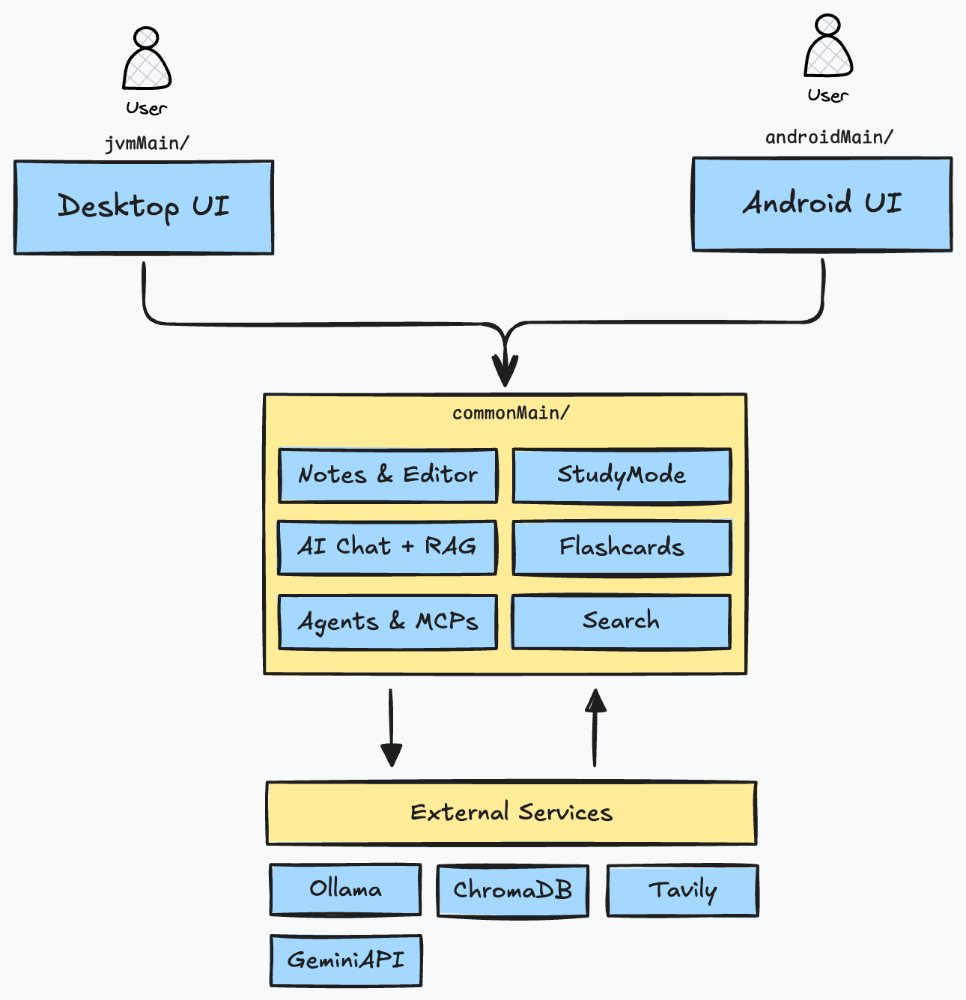

# Krypton
Krypton is an AI-Powered Markdown Workspace for Learning and Research, built for Desktop and Android. Built with Kotlin Multiplatform, Krypton combines intelligent note-taking with a RAG-Powered Chat, Semantic Search, and Goal-Driven study tools to create a comprehensive knowledge management system and a "**Second Brain**".

You can treat Krypton as your final knowledge base and your second brain, as mentioned above. You can query your notes, make edits, learn a topic quickly, or learn a topic in detail. You can create timed Study Plans and generate flashcards as well for a quick crash course over a topic.


---
## High-Level Overview
Here is a very basic high-level architecture of the app:



The core logic is written in `src/commonMain` and the platform specific code is in `src/jvmMain` for Desktop and `src/androidMain` for Android.
Krypton makes use of some external services such as:
- Ollama/Gemini for Chat
- ChromaDB as the main VectorDB (both ChromaDB local and ChromaDB cloud are supported)
- Tavily for Web-enabled Searches and results

All services have been added to allow for graceful failure. However, either Ollama or GeminiAPI is necessary for normal chat. If ChromaDB or Tavily are unavailable, chat falls back to normal.

> [!IMPORTANT]
> The Desktop app can make use of either Ollama or GeminiAPI to generate its responses or embeddings. However, Android only support GeminiAPI for now.
> Similarly, Desktop can utilise local or cloud embeddings, while Android can only use ChromaDB Cloud as generating and storing embeddings locally was out of scope for this project in the given timeline. Maybe in the future yes would like to extend Android as well for a full local experience.


### Core Features
1. Markdown Notes & Vaults
	- Modern markdown editor with *live preview*, autosave, and full undo/redo.
	- Directory‑based vaults with full file and folder CRUD operations.
	- Per‑platform file access: native file system on Desktop and *SAF* on Android.

2. AI & Search
	- AI chat over your notes with multiple retrieval modes (NONE, RAG, WEB, HYBRID).
	- Retrieval‑augmented answers using semantic search over your local markdown vault.
	- Optional web search integration for up‑to‑date information and hybrid local+web answers.

3. Agentic Integration into the Chat
	- MasterAgent that classifies intent and routes to specialized tools.
	- Agents for **creating notes**, **searching notes**, **summarizing notes**, **generating flashcards**, and **managing study goals**.
	- Graceful fallback to normal chat when no specialized agent is needed.
	- All agents are also exposed as tools via MCP-SSE

4. Study Goals & Flashcards
	- Create study goals with topics and automatically matched notes.
	- Generate summaries and flashcards from notes to prepare quick or detailed study sessions.
	- Quiz mode with scoring and progress tracking across sessions and goals.

5. Cross‑Platform Experience using KMP (Kotlin Multiplatform)
	- Desktop app with multi‑panel layout and docked sidebars.
	- Android app with touch‑optimized UI and bottom navigation.
	- Shared core logic in Kotlin Multiplatform with thin platform layers for integrations.


---
## Getting Started
Here is a detailed step-by-step path to run the app and try it out on both Desktop and Android.

### Prerequisites
Here are the prerequisites for running the app:

|          | Item                       | Description                                                                    | Links |
| -------- | -------------------------- | ------------------------------------------------------------------------------ | ----- |
| Required | **JDK17+**                 |                                                                                |       |
| Required | **Android SDK**            | An Android SDK is required to be installed locally                             |       |
| Optional | **Ollama**                 | For local LLM Responses in Chat                                                |       |
| Optional | **Gemini API Key**         | For running without Ollama                                                     |       |
| Optional | **ChromaDB**               | For RAG features. Can be installed locally or (recommended) via Docker as well |       |
| Optional | **ChromaDB Cloud API Key** | For RAG features. ChromaDB Cloud can also be used instead of local ChromaDB    |       |
| Optional | **Tavilly API Key**        | To enable Web Search in Chat Responses                                         |       |

Note that either Ollama or a GeminiAPI Key are *required* for chat to function. You can toggle which one you want to use in the UI or from `settings.json`

### How to Run the App
Here is a step-by-step guide for running and testing out the app.

###### **Step 1: Clone the Git Repository**
You need to clone the Git Repository into a clean location.

```git
git clone https://github.com/JohnLocke117/Krypton.git
cd krypton
```

###### **Step 2: Start up the External Services**
For the best experience, it is recommended to have all of the prerequisites ready.
As mentioned before, you need either Ollama or Gemini to use the chat features. You can skip one of them if planning on using either.

**Setup ChromaDB**
ChromaDB is the VectorDB that we'll be using for RAG here. It is required if you want to query your notes, but not required for just normal chats.

ChromaDB can be installed via the ChromaDB CLI or via a more recommended way that is Docker.
To install the ChromaDB CLI, use:

```sh
pip install chromadb
# Run the server and specify a persistence path
chroma run --path ./chroma_server_data --port 8000
```

To run ChromaDB via Docker, run the following commands in a terminal:

```sh
# Pull the image
docker pull chromadb/chroma:latest

# Create a Volume
docker volume create chroma-data

# Run the container, mapping port 8000 and using chroma-data Volume for persistance
docker run -d \
  --name chromadb \
  -p 8000:8000 \
  --mount type=volume,src=chroma-data,target=/data \
  -e IS_PERSISTENT=TRUE \
  -e PERSIST_DIRECTORY=/data \
  -e ANONYMIZED_TELEMETRY=FALSE \
  chromadb/chroma:latest
```

After the ChromaDB Server is installed, you can make sure that it is running properly on port 8000 via:

```sh
curl --location 'http://localhost:8000/api/v2/healthcheck'
```


**Setup Ollama**
This is Optional if you just want to use GeminiAPI.
Here, we'll setup Ollama for local LLM responses in the chat. We'll be needing a Generator model and an Embedding Model.
You can download the Ollama client from [Ollama Client Download](https://ollama.com/download).

After that, you need to install a *Generator Model* (for the Responses) and an *Embedding Model* (for the RAG). Optionally, you can also install a dedicated Re-Ranker model as well (recommended for the best experience).

```sh
# Check if Ollama is installed
ollama --version

# Install a Generator Model
ollama pull llama3.1:8b

# Install an Embedding Model
ollama pull mxbai-embed-large:335m

# (Optional) Install a Dedicated Re-Ranker Model
ollama pull dengcao/Qwen3-Reranker-8B:Q3_K_M

# List all Installed Models:
ollama list
```

After downloading all the models that you need, just start up the server in another terminal:

```sh
ollama serve
```

Krypton assumes that Ollama will run by default on `http://localhost:11434`

##### **Step 3: Setup Environment Variables**
Here, we're going to setup some environment variables required by the app to run. By default, all API Keys and variables are stored in a `local.properties` file.

At the project root, create a `local.properties` files. In the file add:

```txt
sdk.dir=<PATH_TO_ANDROID_SDK>

TAVILLY_API_KEY=<YOUR_TAVILLY_API_KEY>

CHROMA_HOST=api.trychroma.com
CHROMA_API_KEY=<YOUR_CHROMADB_CLOUD_API_KEY>
CHROMA_TENANT=<YOUR_CHROMADB_CLOUD_TENANT_ID>
CHROMA_DATABASE=<YOUR_CHROMADB_CLOUD_DATABASE_NAME>

GEMINI_API_BASE_URL=https://generativelanguage.googleapis.com/v1beta/models/gemini-2.5-flash:generateContent
GEMINI_API_KEY=<YOUR_GEMINI_API_KEY>

OLLAMA_BASE_URL=http://localhost:11434
OLLAMA_GENERATION_MODEL=llama3.1:8b
OLLAMA_GENERATION_MODEL_CONTEXT_LENGTH=128000
OLLAMA_EMBEDDING_MODEL=mxbai-embed-large:335m
OLLAMA_EMBEDDING_MODEL_CONTEXT_LENGTH=512
```

Note that:
1. `sdk.dir` points to the location of the installed Android SDK. It is required to test out the Android app.
2. All the Chroma Credentials are only required if you want to use ChromaDB Cloud.

##### **Step 4: Run the Desktop App**
After all is in place, you can build and run the app via gradle.
Open another terminal and navigate to the project root. There, run:

```sh
# macOS / Linux
./gradlew :composeApp:run

# Windows
.\gradlew.bat :composeApp:run
```

On the first build, Gradle will download all the dependencies hence might take some time to boot up. Further runs will be quick.

##### **Step 5: Run the Android App**
Make sure that the Android SDK is installed.
From IntelliJ Idea (recommended) or Android Studio:
1. Open the `krypton` project in IntelliJ
2. Wait for Gradle sync to finish.
3. Select the `android` run configuration.
4. Choose a device/emulator (API 24+).
5. Click Run.

You would require to connect your Android device (with USB Debugging turned on) to run the app on your phone. As an alternative, you can setup a virtual device as well and run the app there.


----
## Detailed Overview of the App
I have also compiled a few other READMEs which you can view for a detailed low-level view of the app, how was it shaped, and the architectural decisions made along the way.

| README                                                         | Description                                                                                                                       |
| -------------------------------------------------------------- | --------------------------------------------------------------------------------------------------------------------------------- |
| [Architecture Design](assets/readme/architecture-design.md)   | This README describes the entire architecture of the app and the key decisions made while building the app                        |
| [AI-Chat](assets/readme/ai-chat.md)                           | This README details the AI powered chat, how was it built and the RAG architecture                                                |
| [Agents](assets/readme/agents.md)                             | This README describes all the agents available in the app, how to use them, and how they are strung together by our `MasterAgent` |
| [Android Architecture](assets/readme/android-architecture.md) | This note describes more about the Android-side of the app, and how was it built.                                                 |


----
## License
Krypton is available with the [MIT License](LICENSE).
