# Krypton Architecture Overview

This document provides a comprehensive overview of Krypton's architecture, design choices, and implementation details. Krypton is an AI-Powered Markdown Workspace for Learning and Research, built as a "Second Brain" that combines intelligent note-taking with RAG-powered chat, semantic search, and goal-driven study tools.

## Introduction

Krypton is built using Kotlin Multiplatform, enabling code sharing between Desktop (JVM) and Android platforms while maintaining platform-specific implementations where needed. The application follows a layered, modular architecture with clear separation of concerns, making it maintainable, testable, and extensible.

### Core Philosophy

- **Platform Independence**: Shared business logic in `commonMain`, thin platform layers for UI and integrations
- **Modularity**: Clear module boundaries with well-defined responsibilities
- **Graceful Degradation**: Features degrade gracefully when dependencies are unavailable
- **Type Safety**: Leverages Kotlin's type system for compile-time safety
- **Reactive**: Uses StateFlow and coroutines for reactive, non-blocking operations

## Overall Architecture

Krypton follows a layered, modular architecture with clear separation of concerns. The application is built using Kotlin Multiplatform, allowing code sharing between platforms while maintaining platform-specific implementations where needed.

### Architecture Layers

```
┌─────────────────────────────────────────┐
│           UI Layer (Compose)             │
│  - State Holders                         │
│  - Composable Components                 │
│  - Theme & Styling                       │
└─────────────────────────────────────────┘
                    ↓
┌─────────────────────────────────────────┐
│         Domain Layer                     │
│  - Editor Domain                         │
│  - Search Domain                         │
│  - Study Domain                          │
│  - Flashcard Domain                      │
│  - Business Logic                        │
└─────────────────────────────────────────┘
                    ↓
┌─────────────────────────────────────────┐
│         Data Layer                       │
│  - Repositories                          │
│  - File System                           │
│  - Settings Persistence                  │
│  - Study Data Persistence                │
│  - Conversation Persistence              │
└─────────────────────────────────────────┘
                    ↓
┌─────────────────────────────────────────┐
│      Infrastructure Layer                │
│  - RAG Components                         │
│  - Vector Store (ChromaDB)                │
│  - LLM Clients                            │
│  - Web Search (Tavily)                    │
│  - MCP Server (JVM only)                 │
└─────────────────────────────────────────┘
```

### Detailed Architecture Diagram

The following Mermaid diagram illustrates the low-level detailed architecture of Krypton, showing all major components and their relationships:

```mermaid
graph TB
    subgraph "UI Layer"
        UI[Compose UI]
        StateHolders[State Holders<br/>EditorStateHolder<br/>ChatStateHolder<br/>SearchStateHolder]
    end
    
    subgraph "Chat System"
        ChatService[ChatService Interface]
        OllamaChatService[OllamaChatService]
        MasterAgent[MasterAgent]
        IntentClassifier[IntentClassifier<br/>LLM-based]
        
        subgraph "Concrete Agents"
            CreateNoteAgent[CreateNoteAgent]
            SearchNoteAgent[SearchNoteAgent]
            SummarizeNoteAgent[SummarizeNoteAgent]
            FlashcardAgent[FlashcardAgent]
            StudyAgent[StudyAgent]
        end
        
        RetrievalService[RetrievalService]
        PromptBuilder[PromptBuilder]
        ConversationRepo[ConversationRepository]
        MemoryProvider[ConversationMemoryProvider]
    end
    
    subgraph "Domain Layer"
        EditorDomain[Editor Domain<br/>Autosave, Undo/Redo]
        SearchDomain[Search Domain<br/>Pattern Matching]
        StudyDomain[Study Domain<br/>StudyPlanner<br/>StudyRunner]
        FlashcardDomain[Flashcard Domain<br/>FlashcardService]
    end
    
    subgraph "RAG Pipeline"
        Indexer[Indexer]
        MarkdownChunker[MarkdownChunker]
        Embedder[Embedder]
        VectorStore[VectorStore<br/>ChromaDB]
        RagRetriever[RagRetriever]
        Reranker[Reranker]
    end
    
    subgraph "Data Layer"
        FileSystem[FileSystem Interface]
        SettingsRepo[SettingsRepository]
        StudyRepo[StudyGoalRepository<br/>StudySessionRepository]
        StudyCache[StudyCacheRepository]
    end
    
    subgraph "Infrastructure"
        LlamaClient[LlamaClient<br/>Ollama/Gemini]
        WebSearchClient[WebSearchClient<br/>Tavily]
        MCP[MCP Server<br/>JVM only]
    end
    
    subgraph "Platform Abstractions"
        VaultPicker[VaultPicker]
        SettingsConfig[SettingsConfigProvider]
    end
    
    UI --> StateHolders
    StateHolders --> ChatService
    StateHolders --> EditorDomain
    StateHolders --> SearchDomain
    StateHolders --> StudyDomain
    
    ChatService --> OllamaChatService
    OllamaChatService --> MasterAgent
    OllamaChatService --> RetrievalService
    OllamaChatService --> PromptBuilder
    OllamaChatService --> ConversationRepo
    
    MasterAgent --> IntentClassifier
    MasterAgent --> CreateNoteAgent
    MasterAgent --> SearchNoteAgent
    MasterAgent --> SummarizeNoteAgent
    MasterAgent --> FlashcardAgent
    MasterAgent --> StudyAgent
    
    RetrievalService --> RagRetriever
    RetrievalService --> WebSearchClient
    RagRetriever --> VectorStore
    RagRetriever --> Reranker
    RagRetriever --> Embedder
    
    Indexer --> MarkdownChunker
    Indexer --> Embedder
    Indexer --> VectorStore
    
    PromptBuilder --> LlamaClient
    OllamaChatService --> LlamaClient
    
    CreateNoteAgent --> FileSystem
    SearchNoteAgent --> RagRetriever
    SearchNoteAgent --> FileSystem
    SummarizeNoteAgent --> RagRetriever
    SummarizeNoteAgent --> FileSystem
    FlashcardAgent --> FlashcardDomain
    FlashcardAgent --> FileSystem
    StudyAgent --> StudyDomain
    StudyAgent --> SearchNoteAgent
    
    StudyDomain --> StudyRepo
    StudyDomain --> StudyCache
    StudyDomain --> FlashcardDomain
    
    EditorDomain --> FileSystem
    SearchDomain --> FileSystem
    
    FileSystem --> VaultPicker
    SettingsRepo --> SettingsConfig
    
    MCP --> CreateNoteAgent
    MCP --> SearchNoteAgent
    MCP --> SummarizeNoteAgent
    MCP --> FlashcardAgent
    MCP --> StudyAgent
    
    style UI fill:#e1f5ff
    style ChatService fill:#fff4e1
    style MasterAgent fill:#ffe1f5
    style Domain fill:#e1ffe1
    style RAG fill:#f5e1ff
    style Infrastructure fill:#ffe1e1
```



## App Layout

### Desktop Layout

The desktop application uses a multi-panel layout optimized for productivity:

- **Left Sidebar**: File browser and vault navigation (collapsible)
- **Main Editor**: Markdown editor with live preview toggle
- **Right Sidebar**: Chat interface (collapsible)
- **Top Bar**: App title, settings access, and vault selection
- **Status Bar**: File path, word count, and editor status

### Android Layout

The Android application uses a navigation-based layout optimized for mobile:

- **Bottom Navigation Bar**: Quick access to main screens
  - Notes List: File browser and vault selection
  - Editor: Markdown editor with preview
  - Chat: AI chat interface
  - Settings: Application settings
- **Top App Bar**: Context-aware title and actions
- **Drawers**: Slide-in navigation for additional options

### Code Design Principles

1. **Separation of Concerns**: Each module has a single, well-defined responsibility
2. **Dependency Inversion**: High-level modules depend on abstractions, not concrete implementations
3. **Interface Segregation**: Interfaces are focused and specific
4. **Single Responsibility**: Each class/function has one reason to change
5. **Reactive Programming**: State changes flow through StateFlow observables
6. **Error Handling**: Graceful degradation with clear error messages

## Technology Stack

### Core Technologies

- **Kotlin Multiplatform**: Shared business logic across platforms
- **Jetpack Compose Multiplatform**: Declarative UI framework
- **Koin**: Dependency injection framework
- **Kotlin Coroutines**: Asynchronous programming
- **Ktor**: HTTP client for API calls (3.2.3 for MCP SDK compatibility)
- **Kermit**: Logging framework
- **JetBrains Markdown**: Markdown parsing library
- **MCP SDK**: Model Context Protocol SDK (0.8.1) for exposing agents as tools

### External Services

- **ChromaDB**: Vector database for embeddings (local via Docker or cloud, required for RAG)
- **Ollama**: Local LLM server for text generation and embeddings (Desktop only, optional but recommended)
- **Gemini API**: Google's Gemini API for LLM interactions (Desktop and Android)
- **Tavily**: Web search API (optional, requires API key)

## Project Structure

### Source Sets

```
composeApp/src/
├── commonMain/              # Shared code across platforms
│   ├── kotlin/org/krypton/
│   │   ├── chat/           # Chat interfaces, agents, retrieval modes
│   │   ├── core/           # Domain logic (editor, search, flashcard)
│   │   ├── data/           # Data layer interfaces
│   │   ├── markdown/       # Markdown parsing and rendering
│   │   ├── rag/            # RAG components (embedding, indexing, retrieval)
│   │   ├── retrieval/      # Retrieval orchestration
│   │   ├── web/            # Web search integration
│   │   ├── platform/       # Platform abstractions
│   │   ├── ui/             # Shared UI components and state holders
│   │   ├── prompt/         # Prompt building
│   │   ├── config/         # Configuration defaults
│   │   └── util/           # Utilities (logging, ID, time)
│   └── sqldelight/         # Database schemas (if used)
├── jvmMain/                # JVM/Desktop-specific code
│   ├── kotlin/             # Desktop UI, DI setup, MCP server, platform impls
│   └── composeResources/   # Resources (fonts, icons, SVG)
└── androidMain/            # Android-specific code
    ├── kotlin/             # Android UI, platform implementations, SAF
    └── AndroidManifest.xml # Android manifest
```

### Module Organization

- **chat/**: Chat service interfaces and models
  - **chat/agent/**: MasterAgent system with LLM-based intent classification
    - **MasterAgent**: Single entry point that routes messages to concrete agents
    - **IntentClassifier**: LLM-based intent classification (LlmIntentClassifier)
    - **IntentType**: Enum for intent types (CREATE_NOTE, SEARCH_NOTES, SUMMARIZE_NOTE, GENERATE_FLASHCARDS, STUDY_GOAL, NORMAL_CHAT, UNKNOWN)
    - **Concrete Agents**: CreateNoteAgent, SearchNoteAgent, SummarizeNoteAgent, FlashcardAgent, StudyAgent (interfaces, not ChatAgent)
  - **chat/conversation/**: Conversation management (ConversationRepository, ConversationMemoryProvider)
  - **chat/rag/**: RAG-specific chat context
  - **chat/web/**: Web search context
  - **chat/ui/**: Chat UI components (message list, status bar)
- **core/domain/**: Business logic and domain models
  - **core/domain/editor/**: Editor domain logic (autosave, undo/redo, document model)
  - **core/domain/flashcard/**: Flashcard generation service
  - **core/domain/search/**: Search domain logic (pattern matching, search engine)
  - **core/domain/study/**: Study system domain (StudyPlanner, StudyRunner, study goals and sessions)
- **data/**: Data access layer (repositories, file system)
  - **data/files/**: File system abstraction interface
  - **data/repository/**: Settings repository and persistence interfaces
  - **data/study/**: Study data persistence (GoalData, StudyData, StudyPersistence)
- **markdown/**: Markdown parsing and rendering (JetBrains Markdown engine)
- **rag/**: RAG pipeline components
  - **rag/reranker/**: Reranking implementations (dedicated and LLM-based)
  - **rag/models/**: RAG data models (Embedding, RagChunk, RagResult)
- **retrieval/**: High-level retrieval orchestration (RagRetriever, RetrievalService)
- **web/**: Web search integration (Tavily API client)
- **ui/**: UI utilities and state management
  - **ui/state/**: State holders (EditorStateHolder, ChatStateHolder, SearchStateHolder)
- **platform/**: Platform abstraction interfaces (VaultPicker, SettingsConfigProvider, NoteFile, VaultDirectory)
- **prompt/**: Prompt building utilities (PromptBuilder, PromptContext)
- **config/**: Configuration defaults and models (RAG, Chat, Editor, UI, Search defaults)
- **mcp/**: MCP server implementation (JVM only)
- **util/**: Utility functions (logging via Kermit, ID generation, time provider)

## Key Design Choices

### 1. Dependency Injection with Koin

**Why Koin?**
- Lightweight and simple
- No code generation required
- Works well with Kotlin Multiplatform
- Easy to test

**Structure:**
- Modules organized by feature (RAG, Chat, UI, Data)
- Singleton services for shared resources
- Factory functions for stateful components

**Example:**
```kotlin
val ragModule = module {
    single<LlamaClient> { /* ... */ }
    single<VectorStore> { /* ... */ }
    single<RagComponents?> { /* ... */ }
}
```

### 2. State Management Pattern

**State Holders:**
- UI state managed by dedicated state holder classes
- Observable state using `StateFlow` or `MutableStateFlow`
- Separation between UI state and domain state

**Domain State:**
- Business logic state in domain layer
- Immutable state objects
- State transitions through domain functions

**Example:**
```kotlin
class EditorStateHolder {
    val domainState: StateFlow<EditorDomainState> = ...
    val leftSidebarVisible: StateFlow<Boolean> = ...
}
```

### 3. Coroutines for Async Operations

**Why Coroutines?**
- Native Kotlin support
- Structured concurrency
- Easy cancellation
- Non-blocking I/O

**Usage:**
- All network operations use `suspend` functions
- File I/O operations are async
- UI updates on main dispatcher
- Background work on `Dispatchers.Default` or `Dispatchers.IO`

### 4. Platform Abstraction

**Common Code:**
- Business logic
- Domain models
- Interfaces and abstractions

**Platform-Specific:**
- UI components (JVM-specific Compose Desktop)
- File system operations
- Dependency injection setup
- Resource loading

### 5. Modular Architecture

**Benefits:**
- Clear separation of concerns
- Easy to test individual modules
- Can swap implementations (e.g., different vector stores)
- Parallel development

**Module Boundaries:**
- Each module has a clear responsibility
- Dependencies flow in one direction (UI → Domain → Data)
- Infrastructure modules are independent

## Markdown Parsing

Krypton uses a custom markdown parsing system built on top of JetBrains Markdown library. The system provides both parsing and rendering capabilities.

### Architecture

```
MarkdownEngine (interface)
    ↓
JetBrainsMarkdownEngine (implementation)
    ↓
AST Conversion
    ↓
BlockNode/InlineNode (custom AST)
    ↓
Compose Rendering
```

### MarkdownEngine Interface

The `MarkdownEngine` interface abstracts markdown parsing:

```kotlin
interface MarkdownEngine {
    fun parseToAst(markdown: String): MarkdownAst
    fun renderToHtml(markdown: String): String
    fun renderToBlocks(markdown: String): List<BlockNode>
}
```

### AST Structure

The custom AST uses sealed classes for type safety:

**Block Nodes:**
- `Heading(level, text, inlineNodes)`
- `Paragraph(inlineNodes)`
- `CodeBlock(code, language)`
- `Blockquote(blocks)`
- `UnorderedList(items)`
- `OrderedList(items, startNumber)`
- `HorizontalRule`

**Inline Nodes:**
- `Text(content)`
- `Strong(inlineNodes)`
- `Emphasis(inlineNodes)`
- `Code(code)`
- `Link(text, url)`
- `Image(alt, url)`

### Parsing Process

1. **JetBrains Parser**: Raw markdown is parsed using JetBrains Markdown parser
2. **AST Conversion**: JetBrains AST is converted to custom `BlockNode`/`InlineNode` structure
3. **Rendering**: Custom AST is rendered to Compose UI

### Implementation Details

#### JetBrainsMarkdownEngine

The implementation converts JetBrains AST nodes to custom nodes:

```kotlin
class JetBrainsMarkdownEngine : MarkdownEngine {
    private val flavour = CommonMarkFlavourDescriptor()
    private val parser = MarkdownParser(flavour)
    
    override fun parseToAst(markdown: String): MarkdownAst {
        val parsedTree = parser.buildMarkdownTreeFromString(markdown)
        val blocks = convertToBlocks(parsedTree.children, markdown)
        return MarkdownAst(blocks)
    }
}
```

#### Node Conversion

**Block Conversion:**
- ATX headings (`#`, `##`, etc.) → `BlockNode.Heading`
- Setext headings (`===`, `---`) → `BlockNode.Heading`
- Code blocks (fenced and indented) → `BlockNode.CodeBlock`
- Lists → `BlockNode.UnorderedList` or `BlockNode.OrderedList`
- Blockquotes → `BlockNode.Blockquote`

**Inline Conversion:**
- Text nodes → `InlineNode.Text`
- Emphasis (`*text*`, `_text_`) → `InlineNode.Emphasis`
- Strong (`**text**`, `__text__`) → `InlineNode.Strong`
- Code spans (`` `code` ``) → `InlineNode.Code`
- Links → `InlineNode.Link`
- Images → `InlineNode.Image`

#### Special Handling

**Code Blocks:**
- Fenced code blocks (```` ```language ````) extract language
- Indented code blocks preserve all content
- Language is stored for syntax highlighting (future feature)

**Lists:**
- Ordered lists extract start number
- Nested lists are supported through recursive conversion
- List items can contain multiple blocks

**Links and Images:**
- Link text and URL are extracted separately
- Image alt text and URL are extracted
- Relative URLs are preserved

### Rendering to Compose

The custom AST is rendered directly to Compose UI:

```kotlin
@Composable
fun MarkdownCompiledView(markdown: String, ...) {
    val engine = remember { JetBrainsMarkdownEngine() }
    val blocks = remember(markdown) {
        engine.renderToBlocks(markdown)
    }
    
    Column {
        blocks.forEach { block ->
            RenderBlock(block, ...)
        }
    }
}
```

**Block Rendering:**
- Headings use Material typography with appropriate sizes
- Paragraphs render inline nodes
- Code blocks use monospace font with background
- Lists render with proper indentation
- Blockquotes have distinct styling

**Inline Rendering:**
- Text uses default styling
- Strong uses bold font weight
- Emphasis uses italic font style
- Code spans use monospace with background
- Links are clickable with distinct color

### HTML Rendering

The engine also supports HTML rendering for export or web preview:

```kotlin
override fun renderToHtml(markdown: String): String {
    val parsedTree = parser.buildMarkdownTreeFromString(markdown)
    return HtmlGenerator(markdown, parsedTree, flavour).generateHtml()
}
```

## RAG Architecture

### Component Structure

```
RagComponents
├── VectorStore (ChromaDB)
├── Embedder (HTTP-based)
├── LlamaClient (Ollama)
├── Indexer
│   ├── NoteFileSystem
│   ├── MarkdownChunker
│   └── Embedder
├── RagService
│   ├── Embedder
│   ├── VectorStore
│   ├── LlamaClient
│   └── Reranker
└── QueryPreprocessor (optional)
```

### Indexing Flow

1. **File Discovery**: `NoteFileSystem` lists all `.md` files
2. **Chunking**: `MarkdownChunker` splits files into semantic chunks
3. **Embedding**: `Embedder` converts chunks to vectors
4. **Storage**: `VectorStore` stores chunks with embeddings

### Retrieval Flow

1. **Query Embedding**: User query is embedded
2. **Vector Search**: `VectorStore` finds similar chunks
3. **Reranking**: `Reranker` scores chunks by relevance
4. **Filtering**: Chunks below threshold are removed
5. **Prompt Building**: Context is formatted into prompt
6. **Generation**: `LlamaClient` generates response

## File System Abstraction

### NoteFileSystem

Abstracts file system operations:

```kotlin
class NoteFileSystem(private val rootPath: String?) {
    fun listMarkdownFiles(): List<String>
    fun readFile(path: String): String?
    fun getFileLastModified(path: String): Long?
}
```

**Benefits:**
- Easy to swap implementations
- Testable with mock file systems
- Platform-specific optimizations possible

## Settings Management

### Settings Structure

Settings are stored as a serializable data class:

```kotlin
data class Settings(
    val version: Int,
    val editor: EditorSettings,
    val ui: UISettings,
    val colors: ColorSettings,
    val app: AppSettings,
    val rag: RagSettings
)
```

### Persistence

- Settings are persisted to JSON file
- `SettingsRepository` manages loading and saving
- Reactive updates via `StateFlow`
- Validation on load

## Error Handling

### Strategy

- **Graceful Degradation**: Features degrade gracefully when dependencies unavailable
- **Logging**: All errors are logged with context
- **User Feedback**: Errors are surfaced to users when appropriate
- **Fallbacks**: Alternative paths when primary fails

### Examples

- RAG unavailable → Falls back to plain chat
- ChromaDB down → Logs error, disables RAG features
- LLM unavailable → Shows error message to user

## Testing Strategy

### Unit Tests

- Domain logic is testable in isolation
- Mock dependencies for external services
- Test state transitions

### Integration Tests

- Test component interactions
- Verify data flow
- Test error scenarios

### UI Tests

- Compose UI testing
- Test user interactions
- Verify state updates

## Performance Considerations

### Optimization Techniques

1. **Lazy Loading**: Components loaded on demand
2. **Caching**: Vector store caches collection IDs
3. **Batch Operations**: Embeddings done in batches
4. **Concurrent Processing**: Parallel file indexing
5. **Incremental Updates**: Only changed files re-indexed

### Memory Management

- State holders use `StateFlow` (efficient)
- Large files chunked to avoid memory issues
- Coroutines properly scoped and cancelled

## Additional Features

### MCP (Model Context Protocol) Server

Krypton includes an MCP server that exposes agents as standardized tools, enabling integration with external clients like Claude Desktop, MCP Inspector, and custom applications.

**Architecture:**
- HTTP server using Ktor with SSE support
- MCP SDK for protocol handling
- Exposes eight tools:
  - `create_note`: Create a new markdown note
  - `search_notes`: Search notes using semantic and keyword search
  - `summarize_notes`: Summarize a note or notes on a topic
  - `generate_flashcards`: Generate flashcards from a note
  - `create_study_goal`: Create a new study goal with topics
  - `plan_study_goal`: Plan sessions for a study goal
  - `generate_roadmap`: Generate a roadmap for a study goal
  - `prepare_session`: Prepare a study session (generate summaries/flashcards)
- Uses concrete agents directly (bypasses MasterAgent for MCP calls)
- Runs as standalone server or embedded in application

**Location:** `composeApp/src/jvmMain/kotlin/org/krypton/mcp/KryptonMcpServer.kt`

**Note:** MCP server calls concrete agents directly, not through MasterAgent, since intent is already determined by the tool name.

See **[Agents & Agentic Architecture](./agents.md)** for detailed MCP server documentation.

### Flashcard Generation

Krypton can generate flashcards from markdown notes using LLM:

**Features:**
- AI-powered flashcard generation from note content
- Question-answer pairs extracted from notes
- Configurable maximum number of cards
- Source file tracking

**Implementation:**
- `FlashcardService` interface in domain layer
- `FlashcardAgent` for chat-based flashcard generation
- Platform-specific implementations in `jvmMain` and `androidMain`
- Uses LLM with structured JSON output
- Integrated into editor UI and exposed as MCP tool

### Study System

Krypton includes a comprehensive study system for managing study goals, planning sessions, and generating learning materials:

**Features:**
- **Study Goals**: Create goals with topics, descriptions, and target dates
- **Session Planning**: Automatically plan study sessions based on goal topics
- **Roadmap Generation**: Generate learning roadmaps for study goals
- **Session Preparation**: Prepare sessions by generating summaries and flashcards
- **Note Matching**: Automatically match relevant notes to study goals

**Implementation:**
- `StudyAgent` orchestrates study goal and session management
- `StudyPlanner` handles goal planning and roadmap generation
- `StudyRunner` prepares sessions and manages quizzes
- `StudyGoalRepository`, `StudySessionRepository`, `StudyCacheRepository` for persistence
- Integrated with `SearchNoteAgent` for note matching
- Exposed as MCP tools: `create_study_goal`, `plan_study_goal`, `generate_roadmap`, `prepare_session`

**Study Flow:**
1. Create a study goal with topics
2. System matches relevant notes from vault
3. Generate roadmap (optional)
4. Plan study sessions
5. Prepare sessions (generate summaries/flashcards)
6. Run study sessions with quizzes

### Android Support

Krypton includes full Android support with mobile-optimized UI and platform-specific implementations.

**Key Components:**
- Mobile navigation with bottom bar (Notes List, Editor, Chat, Settings)
- Android-specific file system using Storage Access Framework (SAF)
- Android settings persistence using SharedPreferences with JSON serialization
- Platform-specific vault picker with SAF integration
- Mobile-optimized UI components (drawers, cards, touch targets)

**Architecture:**
- Platform abstractions in `commonMain` (interfaces: VaultPicker, SettingsConfigProvider, FileSystem)
- Android implementations in `androidMain` (AndroidVaultPicker, AndroidSettingsConfigProvider, AndroidFileSystem)
- Dependency injection via `androidPlatformModule` registered in MainActivity
- Shared business logic across platforms (all domain, RAG, chat logic in commonMain)

**UI Differences:**
- Desktop: Multi-panel layout with docked sidebars
- Android: Single-screen navigation with slide-in drawers

See **[Android Support](./android.md)** for comprehensive Android documentation.

## Future Architecture Considerations

### Planned Improvements

1. **iOS Support**: Extend to iOS platform
2. **Plugin System**: Allow custom extensions
3. **Enhanced Mobile Features**: Improved mobile UI/UX
4. **Loose Coupling**: Further decouple components
5. **Configuration**: Move more configs to settings

### Scalability

- Architecture supports horizontal scaling
- Vector store can be externalized
- LLM can be remote service
- Stateless components where possible
- Multi-platform support via Kotlin Multiplatform

## Technology Versions

Key technology versions used in Krypton:

- **Kotlin**: 2.2.21
- **Compose Multiplatform**: 1.9.3
- **Koin**: 3.5.6
- **Ktor**: 3.2.3 (for MCP SDK compatibility, overrides libs.versions.toml)
- **Kermit**: 2.0.4
- **Kotlinx Coroutines**: 1.10.2
- **Kotlinx Serialization**: 1.7.3
- **MCP SDK**: 0.8.1
- **JetBrains Markdown**: 0.5.2
- **Android Gradle Plugin**: 8.7.3
- **Android SDK**: Min 24, Target 35

Note: Ktor 3.2.3 is required for MCP SDK compatibility and is specified directly in `build.gradle.kts` rather than using the version catalog.

## Conclusion

Krypton's architecture prioritizes:

- **Modularity**: Clear separation of concerns with dedicated modules
- **Testability**: Easy to test individual components through interfaces
- **Maintainability**: Clean code structure with clear boundaries
- **Extensibility**: Easy to add new features through well-defined interfaces
- **Performance**: Efficient resource usage with coroutines and lazy loading
- **Platform Independence**: Shared business logic with platform-specific implementations

The architecture evolves with the project, maintaining these principles while adapting to new requirements. The modular design allows for easy extension and modification without affecting other parts of the system.

