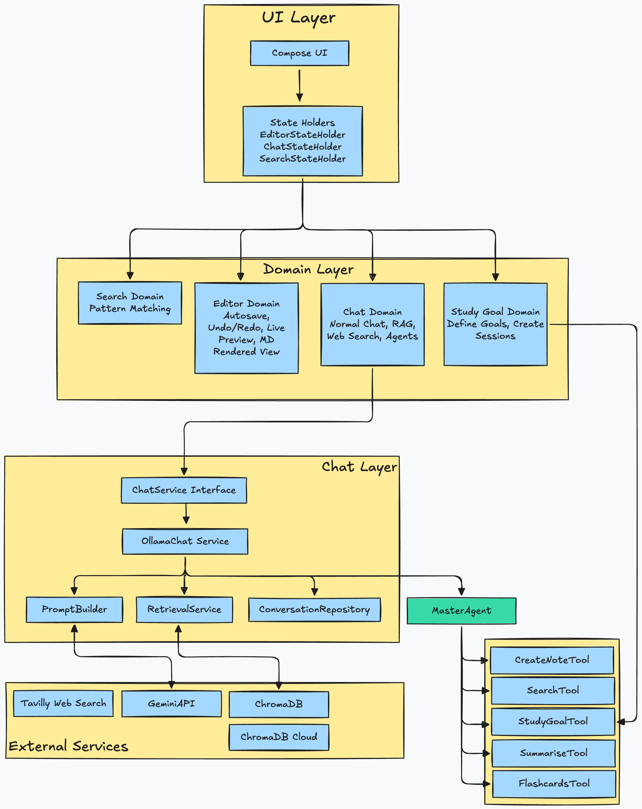

# Krypton Architecture Design
This document gives a friendly tour of how Krypton is put together under the hood – the layers, the modules, and the key design decisions that make the app tick. Krypton is an AI‑Powered Markdown Workspace and **second brain** for learning and research, built with Kotlin Multiplatform for Desktop and Android.
As this app was built for the KMP Contest, I started out with an oath to utilise as much as Kotlin Tooling as possible, and I found some great open-sourced work along the way, which overall turned out to be a very fun path of building what I wanted.




---
## The Big Picture: How Krypton Is Structured
Krypton uses Kotlin Multiplatform to share as much logic as possible between Desktop (JVM) and Android, while still giving each platform its own UI and integrations. The result is one shared brain with two different bodies.​

At a high level:
- **Shared core (`commonMain`)**
    - All the important logic lives here: notes, search, RAG, chat, agents, settings, and most of the state management.
    - This is where Krypton decides _what_ to do, regardless of whether you are on Desktop or Android.​

- **Platform layers (`jvmMain`, `androidMain`)**
    - Desktop and Android get their own UIs, file systems, DI setup, and platform‑specific wiring.
    - These layers are as thin as possible so the shared core does most of the heavy lifting.

- **External services**    
    - LLMs: Ollama or Gemini for chat and embeddings.
    - Vector DB: ChromaDB (local or cloud) for RAG over our notes.
    - Web search: Tavily for web‑augmented answers.


Everything is designed to **fail gracefully**: if RAG or web search are unavailable, chat falls back to a normal LLM conversation; if a service is missing, the app still works instead of exploding.


---
## Core Design Principles
Krypton’s architecture is guided by a few simple principles that show up everywhere in the code.
- **Platform independence**
    - Core logic is written once in `commonMain`, with platform code only where truly necessary (UI, file access, DI setup, etc.).

- **Modularity**
    - Features like chat, RAG, markdown, and settings live in their own modules with clear responsibilities and boundaries.

- **Graceful degradation**
    - If ChromaDB, Tavily, or even Ollama are missing, the app still behaves sensibly and falls back to simpler modes.

- **Type safety and clarity**
    - Domain models and sealed hierarchies keep reasoning about state and flows safer and easier.

- **Reactive by default**
    - `StateFlow` and coroutines power state updates and async work, so the UI can just observe and react.

These principles are what make Krypton relatively easy to grow over time without turning into a giant monolith that explodes all at once (all care is taken to avoid that but I wish I could guarantee this).


---
## How Things Are Wired: DI, State, and Async
### Dependency Injection with Koin
Krypton uses **Koin** as its DI framework because it is lightweight, works well with KMP, and does not require code generation.

- Modules are grouped by feature (e.g., RAG, Chat, Data, UI), which keeps the wiring close to the actual feature.
- Long‑lived services (LLM clients, vector stores, repositories) are registered as singletons.
- State holders and view‑like models are usually factories so each screen gets its own instance when needed.

Example (simplified RAG module):

```kotlin
val ragModule = module {
    single<LlamaClient> { /* ... */ }
    single<VectorStore> { /* ... */ }
    single<RagComponents?> { /* ... */ }
}
```

### State Management: “State holders, not god view models”
UI‑visible state is managed by dedicated **state holder** classes. These are the bridge between the domain layer and the UI layer.

- They expose **immutable** `StateFlow`s like `EditorDomainState` and UI flags (sidebars visible, current selection, etc.).
- Business logic lives in the domain layer; state holders orchestrate that logic and adapt it for the UI.

Example:

```kotlin
class EditorStateHolder {
    val domainState: StateFlow<EditorDomainState> = ...
    val leftSidebarVisible: StateFlow<Boolean> = ...
}
```

### Coroutines and Async Work
Krypton uses Kotlin coroutines across the board for async operations.

- All network calls (LLM, Tavily, Chroma) are `suspend` functions.
- File I/O is done off the main thread, using proper dispatchers (`IO`/`Default`).​
- UI updates are marshalled back to the main dispatcher to keep rendering smooth.​

This keeps the code readable while still handling slow operations like embedding generation, indexing, and chat calls.


---
## Platform Abstractions and File System
Krypton runs on Desktop and Android, but it treats both as implementations of a common set of contracts.

### Platform abstraction
- **In common code**:
    - Domain models, core flows (chat, agents, RAG, notes, goals), and interfaces for things like file systems, clocks, and logging.

- **On each platform**:
    - Actual implementation of these interfaces, such as file I/O via native FS on Desktop and **SAF** on Android, plus platform UIs and DI setup.

This lets the core logic pretend it is talking to a generic “file system” or “vector store”, even though the underlying implementation may be very different between platforms.​

### Note file system abstraction
File operations go through a `NoteFileSystem` abstraction so code does not need to know about SAF, desktop paths, or any other low‑level detail.

```kotlin
class NoteFileSystem(private val rootPath: String?) {
    fun listMarkdownFiles(): List<String>
    fun readFile(path: String): String?
    fun getFileLastModified(path: String): Long?
}
```

Benefits:
- Easy to swap between different file backends.
- Testable using fake or in‑memory file systems.
- Platform‑specific optimizations without touching the shared logic.


---
## Markdown Engine: How Raw Notes Turn Into UI
Markdown is at the heart of Krypton, so it gets its own small architecture. Krypton uses a custom markdown engine on top of the **JetBrains Markdown Parser** to parse content and render it directly into Compose.

## Flow of markdown processing

```txt
MarkdownEngine (interface)
    ↓
JetBrainsMarkdownEngine (implementation)
    ↓
AST Conversion
    ↓
BlockNode / InlineNode (custom AST)
    ↓
Compose Rendering
```


- `MarkdownEngine` defines the core API for parsing markdown into an AST, turning it into blocks, or rendering to HTML.    
- `JetBrainsMarkdownEngine` implements this using JetBrains Markdown and then converts its AST into Krypton’s own sealed block/inline node types for type‑safe rendering.

##### Key ideas
- **Custom AST**
    - Block nodes: headings, paragraphs, code blocks, lists, blockquotes, horizontal rules.
    - Inline nodes: text, strong, emphasis, code spans, links, images.

- **Rendering to Compose**
    - The UI walks the custom AST and renders each block and inline node with appropriate styling.
    - This makes it easy to tweak the look of headings, code blocks, lists, and so on without changing the parser.

- **HTML export**
    - The same engine can render HTML when needed using `HtmlGenerator`, which is handy for export or previews.


---
## Settings and Configuration
User and app settings are modelled as a serializable data class and stored as JSON.

```kotlin
data class Settings(
    val version: Int,
    val editor: EditorSettings,
    val ui: UISettings,
    val colors: ColorSettings,
    val app: AppSettings,
    val rag: RagSettings
)
```

- A `SettingsRepository` is responsible for loading and saving this structure.
- Settings are exposed as a `StateFlow`, so when a setting changes (for example, toggling between Ollama and Gemini or tweaking RAG behaviour), the UI and core logic can react immediately.
- Basic validation on load helps avoid bad data silently breaking the app.


---
## The Future
While building this app, I went from almost zero in the Kotlin ecosystem to a decent place now (I would hope). In the meantime, I have identified multiple avenues where I can improve the app, as well as provide some independent tooling for the Kotlin community as well:

- Live Preview Markdown Renderer: Right now, the Live Preview is built on a hastily-built wrapper over the JetBrains Markdown Parser, which was a godsend for this project (thanks JetBrains for another W). However, for a future release, I would target to make this wrapper better, and do an overall visually better and faster job at rendering blocks of Markdown
- A Text-Editor/File-Explorer Template: I also plan to scale-down and expose a skeleton-Krypton as a standalone Text-Editor or a File Explorer, so that anyone who wants to build a similar app can fork and start working, and customise it as they deem fit.
